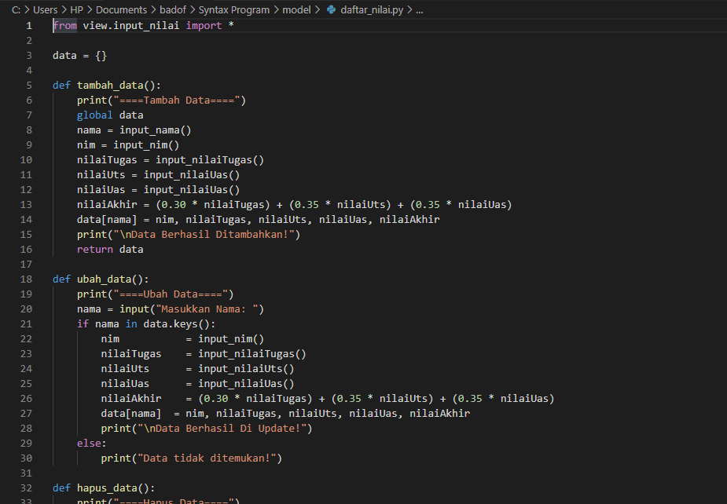
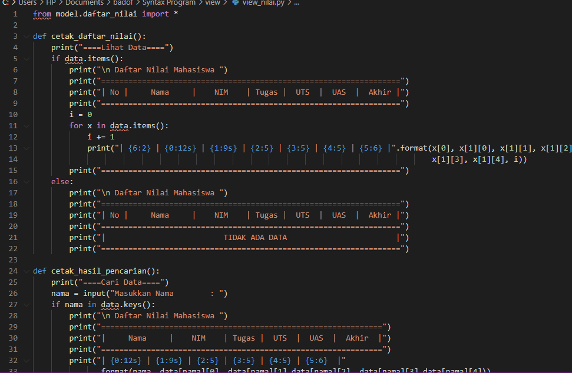
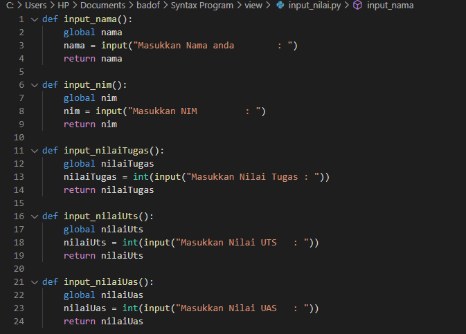
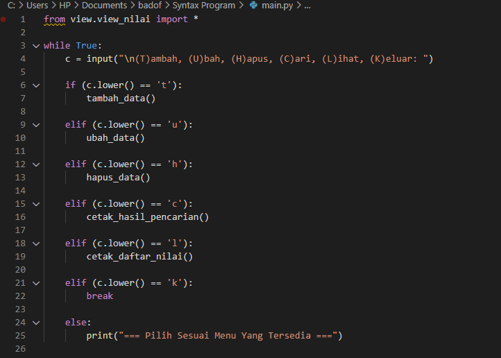
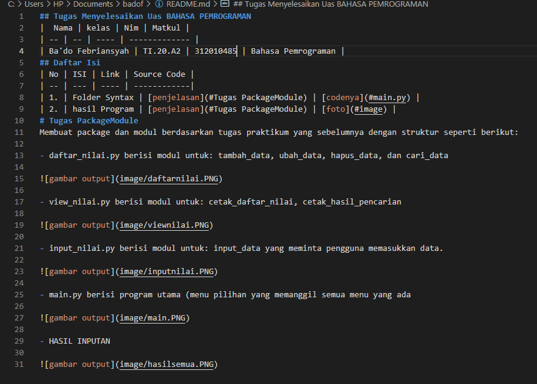

# Tugas PackageModule
Membuat package dan modul berdasarkan tugas praktikum yang sebelumnya dengan struktur seperti berikut:

- daftar_nilai.py berisi modul untuk: tambah_data, ubah_data, hapus_data, dan cari_data

- view_nilai.py berisi modul untuk: cetak_daftar_nilai, cetak_hasil_pencarian

- input_nilai.py berisi modul untuk: input_data yang meminta pengguna memasukkan data.

- main.py berisi program utama (menu pilihan yang memanggil semua menu yang ada

- HASIL INPUTAN
